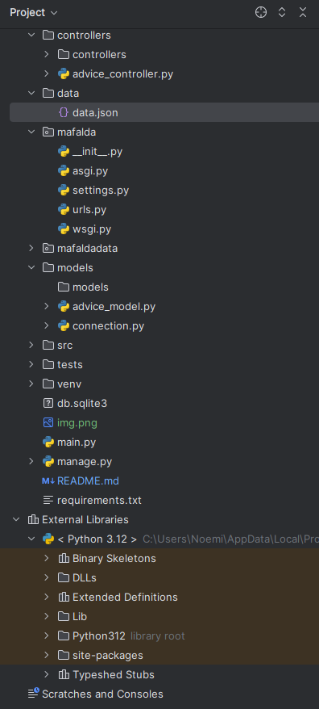

# mafalda 
Guidance on children's mental health.

## Índice

- [Proyecto 📝](#proyecto-)
    - [Requisitos previos](#requisitos-previos-)
- [Instalación 🛠️](#instalación-)
    - [Requerimientos](#requerimientos-)
- [Estructura del proyecto](#estructura-del-proyecto-)
- [Tecnologías](#tecnologías-)
- [Uso](#uso-)
- [Contribución 🤝](#contribución-)
- [Desarrolladores 👩‍💻](#desarrolladores-)
- [Demo](#demo-)

## Proyecto 

Mafalda es una aplicacion  que provee una orientacion en salud mental infantil . Después de ingresar parámetros específicos, la aplicación filtra los datos para mostrar consejos relevantes. Este consejo ayuda a determinar si podría ser necesaria una consulta con un profesional., con una base de datos PostgreSQL, mientras que el frontend está planeado para desarrollarse con tecnologías web como React.

### Requisitos previos

**Funcionalidades**

- Selección de genero
- Seleccion de edad
- Seleccion de conducta
- Visualizacion de un consejo


## Instalación 🛠️

### Requerimientos

- [Python 3.x](https://www.python.org/downloads/)
- [PostgreSQL](https://www.postgresql.org/download/)
- [Virtualenv](https://virtualenv.pypa.io/en/latest/)
- [Git](https://git-scm.com/)

1. Clona el repositorio del backend:

    ```bash
    git clone https://github.com/noemipeteilh/mafalda/issues
    ```

2. Crea y activa un entorno virtual:

    ```bash
    cd mafalda
    python -m venv env
    source env/bin/activate  # En Windows usa: env\Scripts\activate
    ```

3. Instala las dependencias:

    ```bash
    pip install -r requirements.txt
    ```

4. Configura tu base de datos PostgreSQL y añade las credenciales en el archivo `settings.py` de Django.

5. Realiza las migraciones y corre el servidor:

    ```bash
   python manage.py makemigrations
    python manage.py migrate
    python manage.py runserver
    ```

## Estructura del proyecto

El proyecto sigue una estructura común para aplicaciones Django, con la API organizada en diferentes módulos para una gestión eficiente.

```plaintext

## Tecnologías

**Backend**
- [Python](https://www.python.org/)
- [Django](https://www.djangoproject.com/)
- [Django REST Framework](https://www.django-rest-framework.org/)
- [PostgreSQL](https://www.postgresql.org/)
- [psycopg2](https://pypi.org/project/psycopg2/) para la conexión con la base de datos PostgreSQL.

**Frontend** *(https://github.com/noemipeteilh/mafalda_guidance)*
- [React.js](https://reactjs.org/)
- [JavaScript](https://developer.mozilla.org/en-US/docs/Web/JavaScript)
- [Axios](https://axios-http.com/es/docs/intro)

## Uso

Para iniciar la aplicación, primero asegúrate de que el servidor de backend esté corriendo:

```bash
python manage.py runserver
```

## Contribución 🤝

1. Haz un fork del repositorio.
2. Crea una nueva rama: 

   ```bash
   git checkout -b feature/nueva-funcionalidad
   ```
3. Realiza tus cambios y haz commit:
    ```bash
   git commit -m 'Agrega nueva funcionalidad'
   ```
4. Haz push de tu rama:  
    ```bash
   git push origin feature/nueva-funcionalidad
    ```
5. Crea un pull request.

## Desarrolladoras 👩‍💻

El equipo de desarrollo de este proyecto está compuesto por:

- **Noemí**(https://github.com/noemipeteilh)

   

